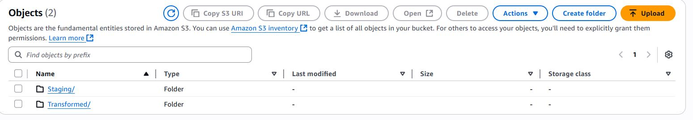
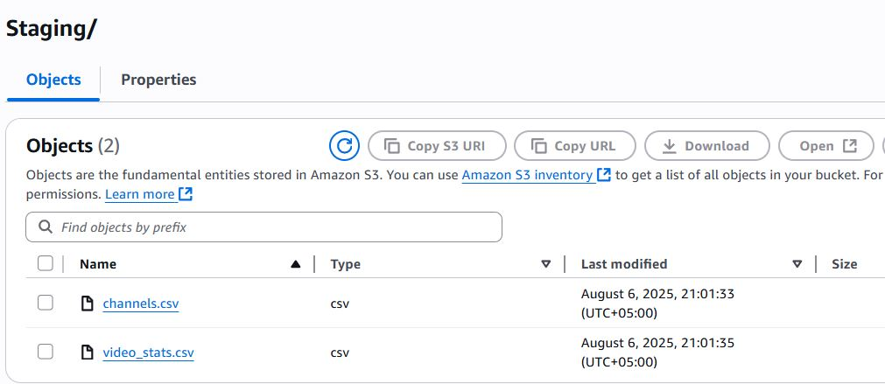
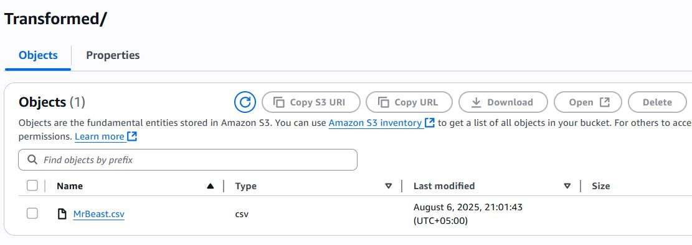
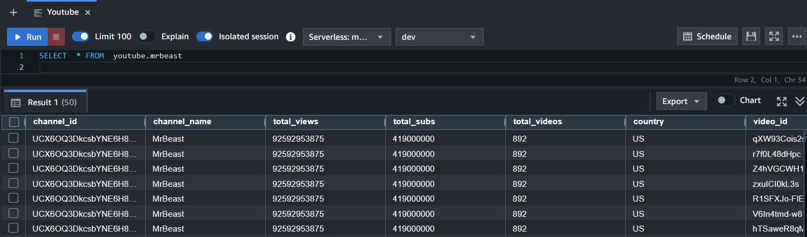

# MrBeast YouTube Data Pipeline

This project builds a full data pipeline using Python and AWS services to fetch public YouTube data from the MrBeast channel and load it into a Redshift table for further analysis. The goal is to show how API data can be transformed and loaded into a data warehouse using clean and modular steps.

---

## 1. Extracting Data from YouTube API (Python Script)

We start by using the YouTube Data API v3. A Python script fetches data about the MrBeast YouTube channel, including basic statistics like total views, subscribers, and video count. It also fetches metadata for the 50 most recent videos uploaded on the channel. This includes video titles, publish dates, and statistics like views, likes, and comments.

All this data is parsed from JSON format using custom functions. The `extract_channel()` function handles the channel-level data, and `extract_video_stats()` processes video-level stats. The results are stored in two separate pandas DataFrames: one for the channel and one for videos.

---

## 2. Uploading CSVs to S3

After extracting and preparing the data, the same Python script uploads the two DataFrames as CSV files into an S3 bucket named `taha-aws`. These files are stored inside a folder called `Staging/`. The two files are:

- `channels.csv` — containing general channel information  
- `video_stats.csv` — containing metadata and performance stats of individual videos

We use the `boto3` library to connect with AWS and the `StringIO()` class to upload the data directly from memory without saving local files.

---

## 3. AWS Lambda: Data Transformation and Redshift Load

An AWS Lambda function is automatically triggered after the files land in S3. Inside this Lambda, the `data_trans()` function downloads both staging CSV files from S3 and loads them into memory. The two datasets are then merged using the `Channel_ID` as the common key.

After merging, the final dataset is saved as a single CSV file named `MrBeast.csv` and uploaded into the `Transformed/` folder inside the same S3 bucket.

Then, the Lambda function connects to Amazon Redshift using `boto3`'s `redshift-data` client. It first truncates the `youtube.mrbeast` table to ensure no duplicate data, and then runs a `COPY` command to load the new data from the `Transformed/MrBeast.csv` file directly into Redshift.

---

## 4. Redshift Table Design

The final table where all transformed data lands is called `youtube.mrbeast`. It contains a combination of channel info and video statistics. The data is now ready for analysis, reporting, or further ETL.

This process uses Redshift's built-in `COPY` command and an IAM Role to securely read the file from S3.

---

## 5. Power BI Dashboard

After loading the cleaned dataset into Amazon Redshift, a Power BI dashboard was created by connecting directly to the `youtube.mrbeast` table using the PostgreSQL connector. The dashboard helps visualize the performance and growth of the MrBeast YouTube channel over time.

It includes key metrics such as:
- Total views and subscriber count  
- Most viewed and liked videos  
- Like-to-view ratios  
- Number of videos published over time  

These visuals help monitor trends and identify high-performing content.  
**Screenshots of the Power BI dashboard can be seen below.**

---

## Folder & File Structure (as used in this project)

- `Staging/channels.csv` — from `extract_channel()` function  
- `Staging/video_stats.csv` — from `extract_video_stats()` function  
- `Transformed/MrBeast.csv` — created after merging both CSVs in Lambda  
- Redshift Table — `youtube.mrbeast`

---

## Technologies Used

This pipeline is built using:

- Python for scripting and orchestration  
- YouTube Data API to fetch data in JSON format  
- Pandas for data handling and DataFrame operations  
- AWS S3 for file storage  
- AWS Lambda for data transformation  
- Amazon Redshift as the data warehouse  
- Power BI for final visualization 

## Status

✅ Project is complete and tested end-to-end.  
✅ Redshift is successfully receiving merged and clean data.  
✅ Ready for visualization or reporting.

